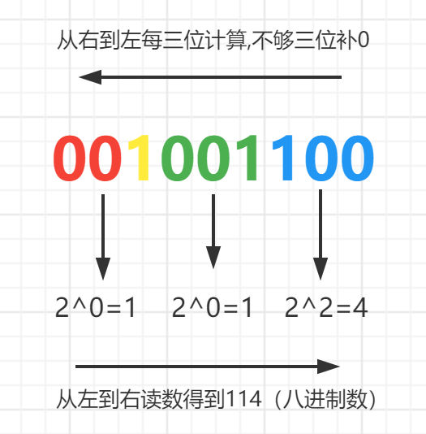
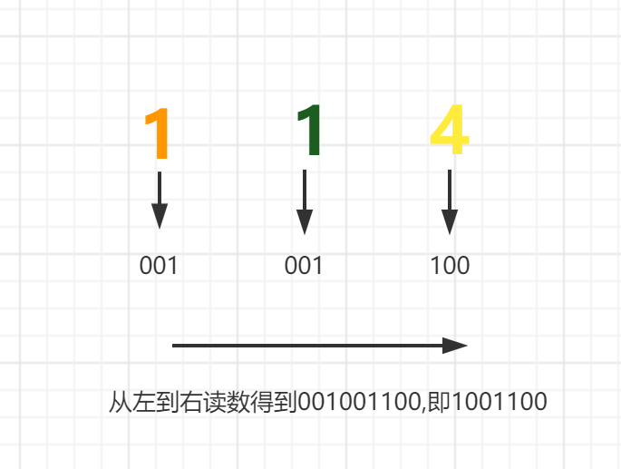

# bit-operation
#### 1. 进制转化

* 十进制转二进制
```
例:542.25 分步计算 先算整数部分 整数部分除以2再以得到的商除以2,以此循环,直到商为0为止,然后从低到高依次读取余数得到结果.
小数部分乘以2得到的数再乘以2依次重复计算,直到小数部分为0,取得到的数的整数部分,从上读到下

542÷2=271...0
271÷2=135...1
...此处为省略步骤
2÷2=1...0
1÷2=0...1

---> 1000011110

0.25×2=0.5
0.5×2=1.0

---> 01

542.25(10)=1000011110.01(2)

```
* 二进制转十进制
```
例:100110

---> 1×2^5+0×2^4+0×2^3+1×2^2+1×2^1+0×2^0=38
```

* 二进制转八进制
```
例:1001100=114(8)
```


* 八进制转二进制
```
例:114(8)=1001100
```


* 二进制转十六进制
```
例:1110100.11(2)=74.c(16) 方法同上二进制转八进制,只不过是按4位计算
```
* 十六进制转二进制
```
例:77bc8(16)=1110111101111001000(2) 从右到左依次取四位,分别除以2,计算余数,不够4位补0,与八进制转二进制原理相同
```

* 十进制转十六进制
```
例:1321 除以16再以得到的商除以16,以此循环,直到商为0为止,然后从低到高依次读取余数得到结果.

1321÷16=82...9
82÷16=5...2
5÷16=0...5

1321(10)=529(16)
```
* 十六进制转十进制
```
例:3BCE 从左到右每一位乘以16的相应次方相加得到结果

E=14×16^0
C=12×16^1
B=11×16^2
3=3×16^3

3BCE(16)=15310(10)
```
