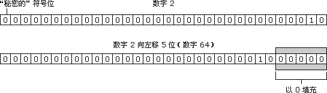

# bit-operation
#### 1. 进制转化

* 十进制转二进制
```
例:542.25 分步计算 先算整数部分 整数部分除以2再以得到的商除以2,以此循环,直到商为0为止,然后从低到高依次读取余数得到结果.
小数部分乘以2得到的数再乘以2依次重复计算,直到小数部分为0,取得到的数的整数部分,从上读到下

542÷2=271...0
271÷2=135...1
...此处为省略步骤
2÷2=1...0
1÷2=0...1

---> 1000011110

0.25×2=0.5
0.5×2=1.0

---> 01

542.25(10)=1000011110.01(2)

```
* 二进制转十进制
```
例:100110

---> 1×2^5+0×2^4+0×2^3+1×2^2+1×2^1+0×2^0=38
```

* 二进制转八进制
```
例:1001100=114(8)
```


* 八进制转二进制
```
例:114(8)=1001100
```


* 二进制转十六进制
```
例:1110100.11(2)=74.c(16) 方法同上二进制转八进制,只不过是按4位计算
```
* 十六进制转二进制
```
例:77bc8(16)=1110111101111001000(2) 从右到左依次取四位,分别除以2,计算余数,不够4位补0,与八进制转二进制原理相同
```

* 十进制转十六进制
```
例:1321 除以16再以得到的商除以16,以此循环,直到商为0为止,然后从低到高依次读取余数得到结果.

1321÷16=82...9
82÷16=5...2
5÷16=0...5

1321(10)=529(16)
```
* 十六进制转十进制
```
例:3BCE 从左到右每一位乘以16的相应次方相加得到结果

E=14×16^0
C=12×16^1
B=11×16^2
3=3×16^3

3BCE(16)=15310(10)
```
* 十六进制转八进制
```
先把十六进制转换为二进制,再把二进制转换为八进制
```
* 八进制转十六进制
```
先把八进制转换为二进制,再把二进制转换为十六进制
```
#### 2.js位运算
* 按位与 &
```
任何数字x,y x,y的对应二进制位都是1则为1,否则为0

8(10)=1000(2)
6(10)=0110(2)
0(10)=0000

console.log(8 & 6) // 0
```
* 按位与赋值 &= 任何数字x,y的二进制操作数按位与后赋值给变量
```
let a = 9
a &= 3
console.log(a) // 1
```
* 按位或 | 任何数字x,y的二进制位对应只要一个是1则为1
```

6(10)=110(2)
3(10)=011(2)
7(10)=111(2)

console.log(6|3) // 7
```
* 按位或赋值 |= 原理同按位与赋值
* 按位非 ~ 任何数字x的结果为 -(x+1)
```
console.log(~5) // -6
console.log(~0) // -1
console.log(~1) // -2
console.log(~-23) // 22
```
* 按位异或 ^  任何数字x,y的二进制位对应都是1则为0 都是0则为0,0 1则为1
```
console.log(6 ^ 3) // 5
```
* 按异或赋值 原理同按位与赋值
* 左移 << 任何数字x向左移动y位  x=x*2**y
```
console.log(6 << 4) // 96
console.log(-6 << 4) // -96
```



* 右移运算符 >>
```
console.log(7 >> 2) // 1
console.log(-7 >> 2) // -2

7 ---> 00000111 ---> 00000001 ---> 1
-7(10)=00000111
  取反=11111000
  +1 = 11111001
  右移2位 = 11111110
  取反    = 00000001
  加1     = 00000010
  二进制  = -2
```

* 头部补零的右移运算符
```
正数与右移运算符原理相同
负数
-4 ---> 11111111111111111111111111111100
带符号的右移一位 ---> 01111111111111111111111111111110
console.log(-4>>>1) // 2147483646

// 查看一个负整数在计算机内部的存储方式:
-1>>>0 // 4294967295
```